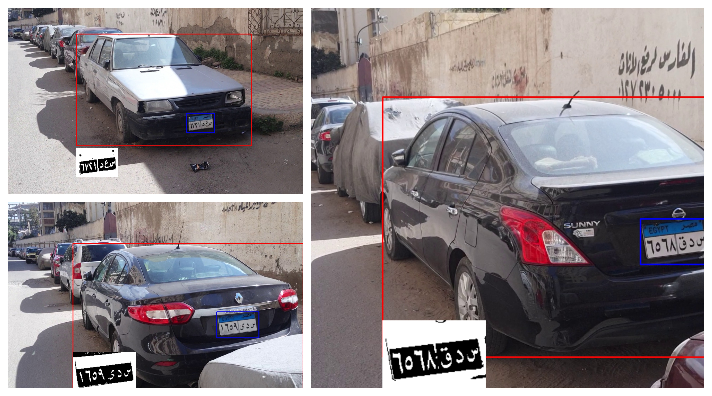
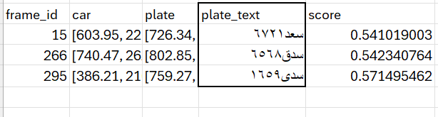

# LicenSee - Egyptian License Plate Reader

LicenSee is a proof-of-concept car registration system that automatically detects vehicles, extracts their  license plates, and performs Optical Character Recognition (OCR) to read the plate numbers. The system then records all of the license plates detected throughout the footage in a file.

## Features

The basic pipeline involves 4 main processes:
- **Car Detection**: Uses [YOLOv11](https://github.com/ultralytics/yolov5) from Ultralytics to detect vehicles in images or video.
- **License Plate Detection**: A fine-tuned YOLOv11 model trained for 30 epochs to specifically recognize and isolate license plates.
- **Car Tracking**: Using [SORT](https://github.com/JaidedAI/EasyOCR) allows for assigning each vehicle a unique id so that multiple license plate detections can be reduced to just one that is the most probable.

- **OCR for Plate Recognition**: Utilizes [EasyOCR](https://github.com/JaidedAI/EasyOCR) for fast and efficient arabic text extraction from detected license plates.

## How It Works

1. **Vehicle Detection and Tracking**  
   The system first detects cars in an image or video using YOLOv11. This ensures that only relevant regions are processed for license plate extraction. Trackers are then updated for each car detection to ensure that we are keeping track of unique IDs.

2. **License Plate Detection**  
   A custom fine-tuned YOLOv11 model is used to locate license plates within the detected vehicles. The model was trained for 30 epochs to improve accuracy but can be further optimized with more data.

3. **OCR Processing**  
   EasyOCR extracts text from the detected license plate. Since OCR results can sometimes be noisy, the system tracks multiple detections of the same vehicle and selects the most confident reading.

   The plate text is filtered based on a known template for egyptian plates (4 numbers and 3 letters) so we can easily rule out bad detections early. 

Detection
     |  Results
:----------------:|:-------------------------:
| 
 
  |   |

## Future Improvements

- Further fine-tuning of the license plate detection model with more labeled data.
- Enhancing OCR processing with post-processing techniques for error correction as some letters get confused with others.